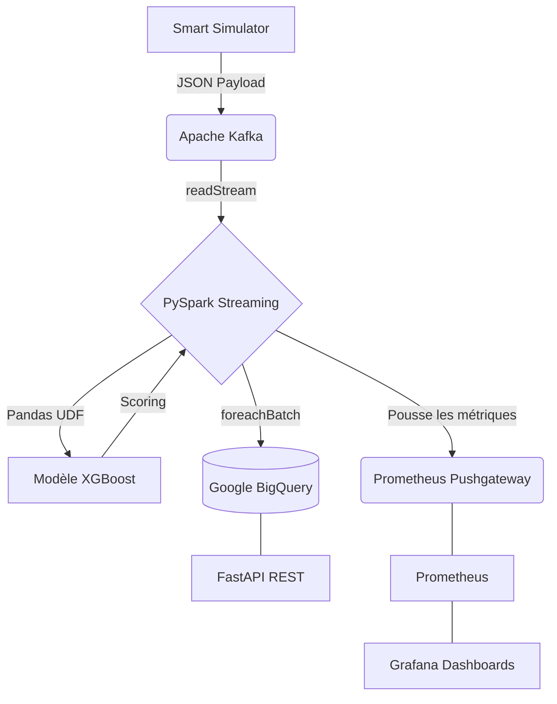

# Real-Time Bank Fraud Detection Platform

Une plateforme distribuée et scalable de détection de fraude bancaire en temps réel.
Ce projet implémente une architecture orientée événements (Streaming) capable d'ingérer des transactions, de les scorer à la volée via un modèle de Machine Learning (XGBoost), et de monitorer l'infrastructure grâce à une stack d'observabilité complète.

Ce projet a été développé dans le cadre d'un cycle d'ingénieur en Génie Informatique (Projet Big Data & Cloud).

---

## Architecture du Système

L'architecture s'écarte du traitement par lots (*Batch*) traditionnel pour adopter un paradigme de **Micro-Batch Streaming**, garantissant une latence minimale.



---

## Stack Technique

L'infrastructure est entièrement conteneurisée et optimisée pour un déploiement Cloud (ex: AWS EC2).

| Domaine             | Technologies                                      |
| :------------------ | :------------------------------------------------ |
| Ingestion           | Simulateur Python custom, Apache Kafka, Zookeeper |
| Traitement          | Apache Spark (PySpark Structured Streaming)       |
| Machine Learning    | XGBoost, scikit-learn, SMOTE, Pandas UDF          |
| Stockage Analytique | Google BigQuery                                   |
| Backend / API       | FastAPI, Uvicorn                                  |
| Observabilité      | Prometheus, Pushgateway, Grafana                  |
| DevOps & Cloud      | Docker, Docker Compose, AWS EC2                   |

---

## Dataset & Modélisation

Contrairement aux datasets anonymisés par PCA, ce projet utilise des données transactionnelles explicites permettant un véritable Feature Engineering métier :

* **Volume :** 10 000 transactions bancaires.
* **Déséquilibre :** ~1.5% de transactions frauduleuses réelles (corrigé avec SMOTE lors de l'entraînement).
* **Features clés :** `location_mismatch`, `velocity_last_24h`, `device_trust_score`, `foreign_transaction`.
* **Modèle de production :** XGBoost (sélectionné pour ses performances en PR-AUC et sa faible empreinte mémoire pour l'inférence temps réel).

---

## Guide de Déploiement

### 1. Prérequis

* Docker et Docker Compose installés.
* Un compte Google Cloud Platform (GCP) avec une table BigQuery configurée.
* Un fichier de clés de service GCP (`gcp-credentials.json`).

### 2. Configuration

Clonez le dépôt et configurez vos variables d'environnement :

```bash
git clone https://github.com/votre-user/fraud-detection-realtime.git
cd fraud-detection-realtime

# Copiez le fichier d'exemple et remplissez vos variables (PROJECT_ID, etc.)
cp config/.env.example config/.env

# Placez votre clé GCP dans le dossier config
# config/gcp-credentials.json
```

### 3. Lancement de l'infrastructure

L'ensemble des 8 micro-services se lance via une commande unique. L'utilisation du flag `--build` garantit la compilation de vos images Python personnalisées (API, Spark, Producer).

```bash
docker compose up -d --build
```

### 4. Utilisation et Accès

Une fois les conteneurs démarrés, le Smart Simulator commence automatiquement à générer et injecter des transactions (légitimes, fraudes en force, fraudes furtives) dans Kafka.

* **API REST (Swagger UI) :** http://localhost:8000/docs
* **Supervision Grafana :** http://localhost:3002 (Identifiant : `admin` / Mot de passe : `fraud2024!`)

> **Note :** Si déployé sur le Cloud, remplacez `localhost` par l'adresse IP publique de votre instance.

---

## Structure du Projet

```plaintext
fraud-detection-realtime/
├── api/                  # Application FastAPI (Routes et Logique)
├── config/               # Variables d'environnement et clés GCP
├── kafka/                # Simulateur de transactions intelligent
├── ml-models/            # Notebooks EDA, entraînement et modèles sérialisés (.pkl/.json)
├── monitoring/           # Configurations Prometheus et provisionning Grafana (Dashboards)
├── spark/                # Jobs PySpark Streaming et intégration ML
├── docker-compose.yml    # Orchestration globale
└── README.md
```

---

## Équipe de Développement

Projet collaboratif réalisé au sein de l'École Nationale des Sciences Appliquées (ENSA), réparti en 3 pôles d'expertise :

* **Pôle Data & ML (Binôme 1) :** EDA, Feature Engineering, Entraînement des modèles (Random Forest, XGBoost), Simulateur de transactions.
* **Pôle Streaming & Backend (Binôme 2) :** Ingestion Kafka, PySpark Structured Streaming, Connecteur BigQuery, API REST FastAPI.
* **Pôle DevOps & Observabilité (Binôme 3) :** Architecture Docker, Déploiement Cloud (AWS), Télémétrie (Pushgateway) et Dashboards Grafana.
